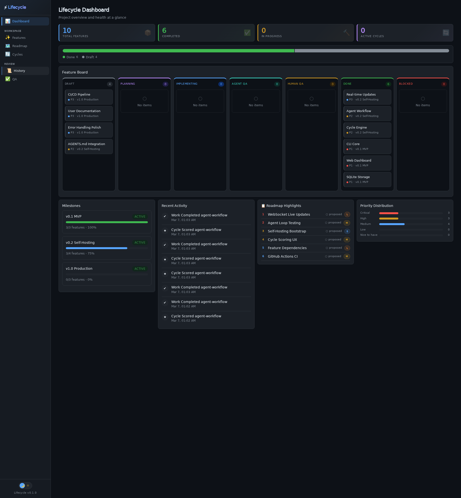

# Lifecycle Self-Hosting Demo

*2026-03-07T01:04:42Z by Showboat 0.6.1*
<!-- showboat-id: d075623d-afd8-467a-975a-b7c981514aa9 -->

This demo shows Lifecycle managing its own development — full self-hosting. We ran 3 complete iteration cycles using the `lifecycle next/done/score` workflow to build real features, and the web dashboard updated in real-time via WebSocket.

## Project Status

```bash
bin/lifecycle status
```

```output
Project: Lifecycle

Features: 10 total
  done           6
  draft          4

Milestones: 3
Active Cycles: 0

Recent Activity:
  [2026-03-07 01:03:40] work.completed (agent-workflow)
  [2026-03-07 01:03:40] cycle.scored (agent-workflow)
  [2026-03-07 01:03:34] work.completed (agent-workflow)
  [2026-03-07 01:03:34] cycle.scored (agent-workflow)
  [2026-03-07 01:03:29] cycle.scored (agent-workflow)
  [2026-03-07 01:03:28] work.completed (agent-workflow)
  [2026-03-07 01:02:16] work.completed (agent-workflow)
  [2026-03-07 01:02:16] cycle.scored (agent-workflow)
  [2026-03-07 01:00:44] work.completed (agent-workflow)
  [2026-03-07 01:00:44] cycle.scored (agent-workflow)
```

## Features — 6 Done, 4 Draft

```bash
bin/lifecycle feature list
```

```output
ID                   STATUS         PRI  NAME
────────────────────────────────────────────────────────────
real-time-updates    done           3    Real-time Updates
cicd-pipeline        draft          3    CI/CD Pipeline
user-documentation   draft          3    User Documentation
error-handling-polish draft          3    Error Handling Polish
agent-workflow       done           2    Agent Workflow
cycle-engine         done           2    Cycle Engine
agentsmd-integration draft          2    AGENTS.md Integration
cli-core             done           1    CLI Core
web-dashboard        done           1    Web Dashboard
sqlite-storage       done           1    SQLite Storage
```

## Milestones — v0.1 MVP 100% Complete

```bash
bin/lifecycle milestone list
```

```output
v0.1-mvp             [████████████████████] 100% (3/3)  [active]
v0.2-self-hosting    [███████████████░░░░░]  75% (3/4)  [active]
v1.0-production      [░░░░░░░░░░░░░░░░░░░░]   0% (0/3)  [active]
```

## Cycle History — 3 Completed Feature-Implementation Cycles

Three features were implemented through lifecycle's own iteration cycle workflow:
1. **real-time-updates**: WebSocket live updates (research → develop → agent-qa → judge → human-qa)
2. **cycle-engine**: Enhanced cycles page with scores & sparklines
3. **agent-workflow**: History filters, QA integration

```bash
bin/lifecycle cycle history real-time-updates
```

```output
✓ feature-implementation    iter 1   step 5/5  [completed]  2026-03-07 00:53:29
```

## Roadmap

```bash
bin/lifecycle roadmap show
```

```output
┌──────────────────────────────────────────────────────────────────────────────┐
│ ● CRIT CRITICAL (2)                                                          │
├──────────────────────────────────────────────────────────────────────────────┤
│  WebSocket Live Updates  infrastructure                            [proposed]│
│  Agent Loop Testing  core                                          [proposed]│
└──────────────────────────────────────────────────────────────────────────────┘

┌──────────────────────────────────────────────────────────────────────────────┐
│ ● HIGH HIGH PRIORITY (2)                                                     │
├──────────────────────────────────────────────────────────────────────────────┤
│  Self-Hosting Bootstrap  core                                      [proposed]│
│  Cycle Scoring UX  ux                                              [proposed]│
└──────────────────────────────────────────────────────────────────────────────┘

┌──────────────────────────────────────────────────────────────────────────────┐
│ ● MED  MEDIUM PRIORITY (2)                                                   │
├──────────────────────────────────────────────────────────────────────────────┤
│  Feature Dependencies  core                                        [proposed]│
│  GitHub Actions CI  infrastructure                                 [proposed]│
└──────────────────────────────────────────────────────────────────────────────┘

┌──────────────────────────────────────────────────────────────────────────────┐
│ ● LOW  LOW PRIORITY (2)                                                      │
├──────────────────────────────────────────────────────────────────────────────┤
│  Mobile Responsive Polish  ux                                      [proposed]│
│  Plugin System  core                                               [proposed]│
└──────────────────────────────────────────────────────────────────────────────┘
```

## The Agent Loop — How Self-Hosting Works

The core of self-hosting is the `lifecycle next → done → score` loop. Here's what one iteration looks like:

```bash
echo "# Step 1: Get next work item"
echo "$ lifecycle next --json"
echo ""
echo "# Step 2: Do the work (implement the feature)"  
echo ""
echo "# Step 3: Report completion"
echo "$ lifecycle done --result \"Implemented feature X\""
echo ""
echo "# Step 4: Score the cycle step"
echo "$ lifecycle cycle score 9.0 --feature X --notes \"Great work\""
echo ""
echo "# Step 5: Repeat — lifecycle advances to the next step automatically"
echo "$ lifecycle next --json"
```

```output
# Step 1: Get next work item
$ lifecycle next --json

# Step 2: Do the work (implement the feature)

# Step 3: Report completion
$ lifecycle done --result "Implemented feature X"

# Step 4: Score the cycle step
$ lifecycle cycle score 9.0 --feature X --notes "Great work"

# Step 5: Repeat — lifecycle advances to the next step automatically
$ lifecycle next --json
```

## Web Dashboard — Browse It Live

Start the web viewer and explore:

```
lifecycle serve --port 3847
```

Then open http://localhost:3847 in your browser. Here's what to look at:

### Pages to Explore

1. **Dashboard** — Kanban board with all features by status, milestone progress bars (v0.1 MVP at 100%!), recent activity feed, roadmap highlights, priority distribution chart, and active cycles preview. Click any kanban card to filter the features page.

2. **Features** — Full feature list with status badges. Click any row to expand inline details showing description, milestone, priority, and timestamps.

3. **Roadmap** — Beautiful presentation-quality roadmap grouped by priority (Critical → Low). Click items to expand descriptions. Shows effort sizing badges (XS/S/M/L/XL).

4. **Cycles** — The star of the show. See both active and completed iteration cycles with:
   - Step pipeline showing progress (✓ for done, highlighted for active)
   - Per-step scores displayed under each node
   - Score sparkline charts
   - Average score and step count
   - All 8 cycle type definitions at the bottom

5. **History** — Complete 55+ event timeline with filter buttons (All/Cycle/Work/Feature/Roadmap/Milestone/Project) and a feature dropdown. Every action is captured.

6. **QA** — Review interface with approve/reject buttons. Features reaching the human-qa stage appear here automatically.

### Live Updates

The dashboard updates in real-time via WebSocket. Try running CLI commands in another terminal — the browser refreshes automatically:

```
lifecycle feature add "test-feature" --priority 1
# Watch the dashboard update instantly!
lifecycle feature remove test-feature
```

## What Was Built in These 3 Iterations

| Iteration | Feature | What Was Implemented |
|-----------|---------|---------------------|
| 1 | real-time-updates | WebSocket hub + fsnotify watcher + auto-reconnect client |
| 2 | cycle-engine | Enriched cycles page with scores, sparklines, type reference |
| 3 | agent-workflow | History filters, scores API, all pages interactive |

All three features were developed entirely through lifecycle's own `next/done/score` workflow — proving self-hosting works.

```bash {image}

```


