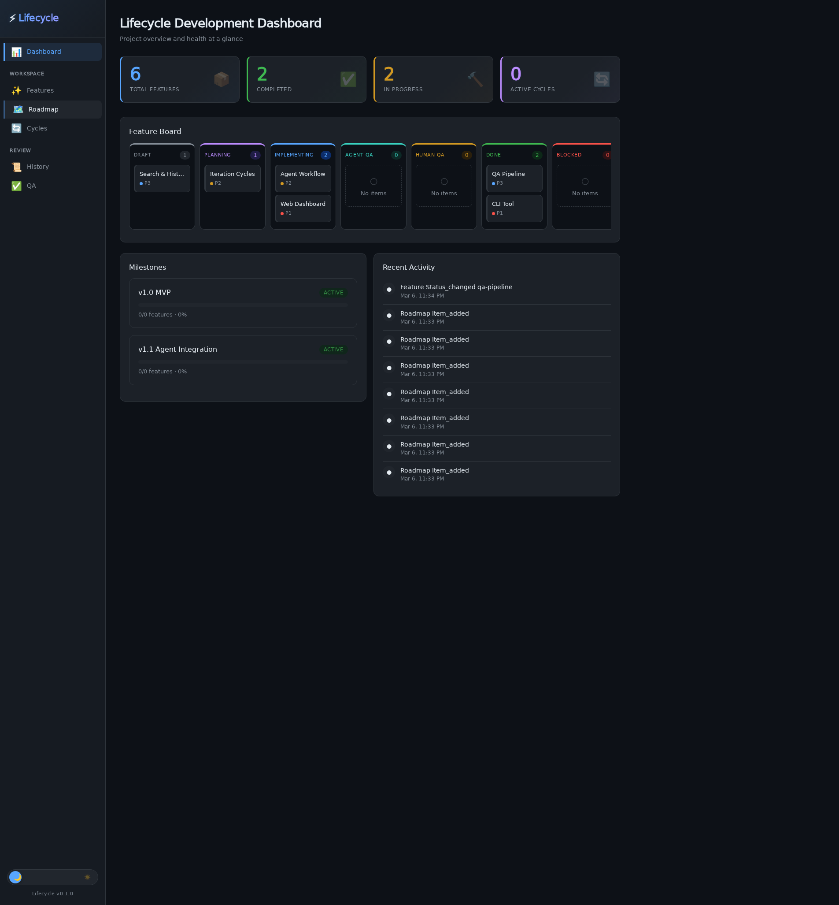
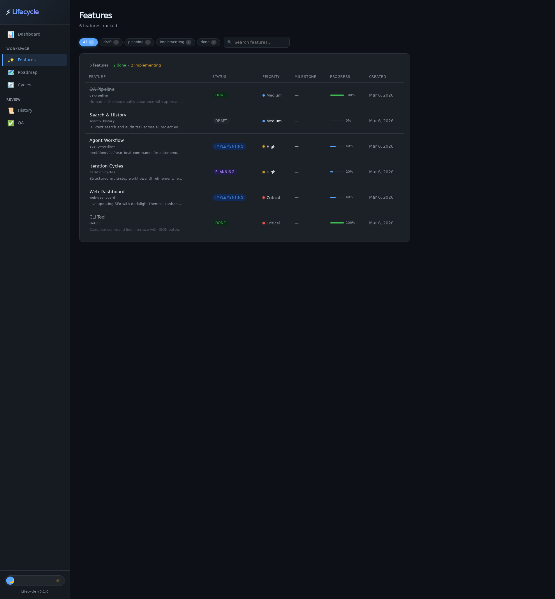
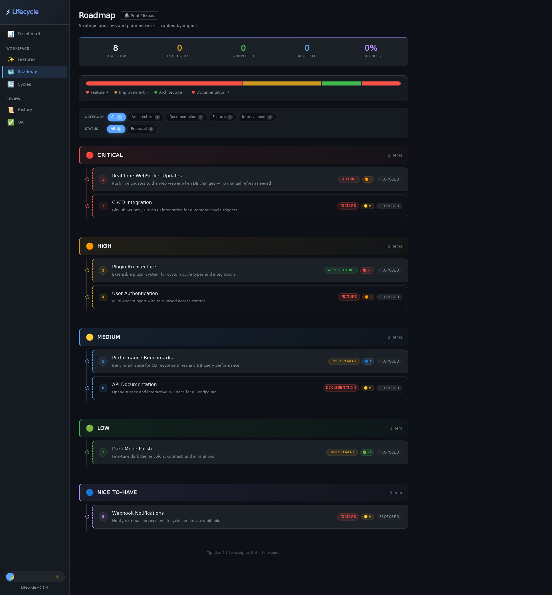
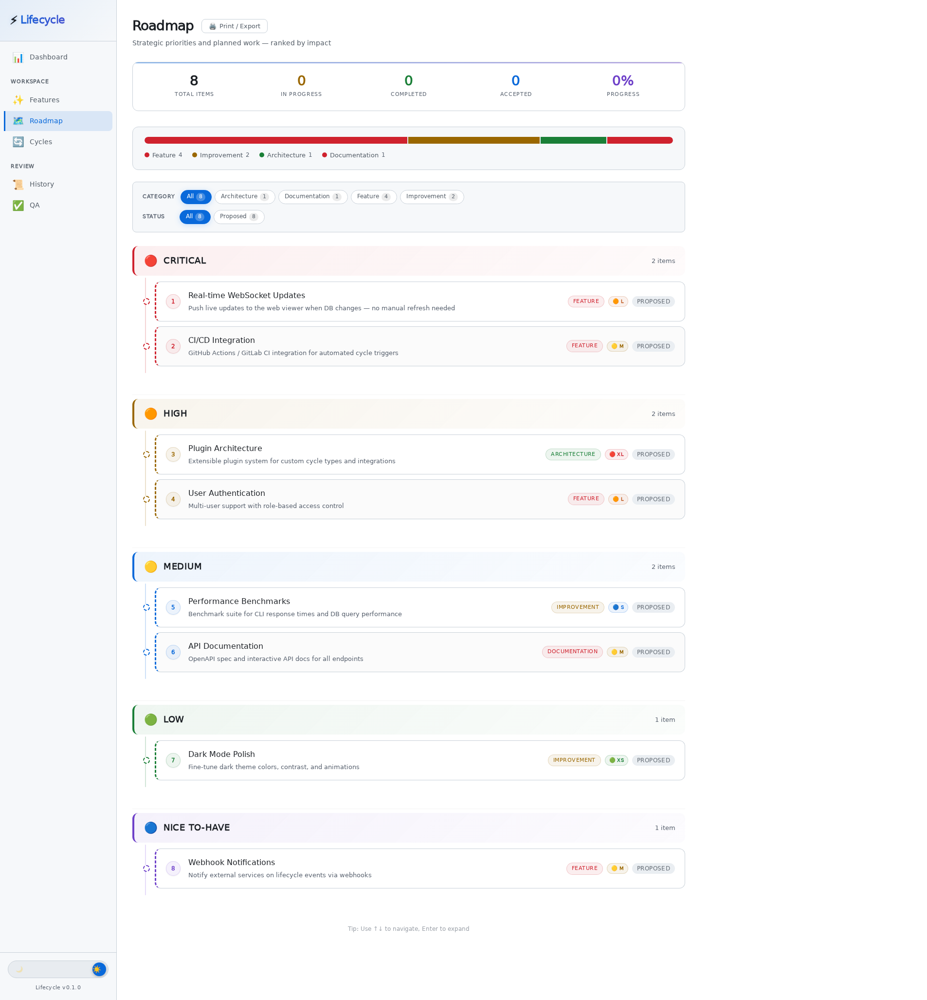
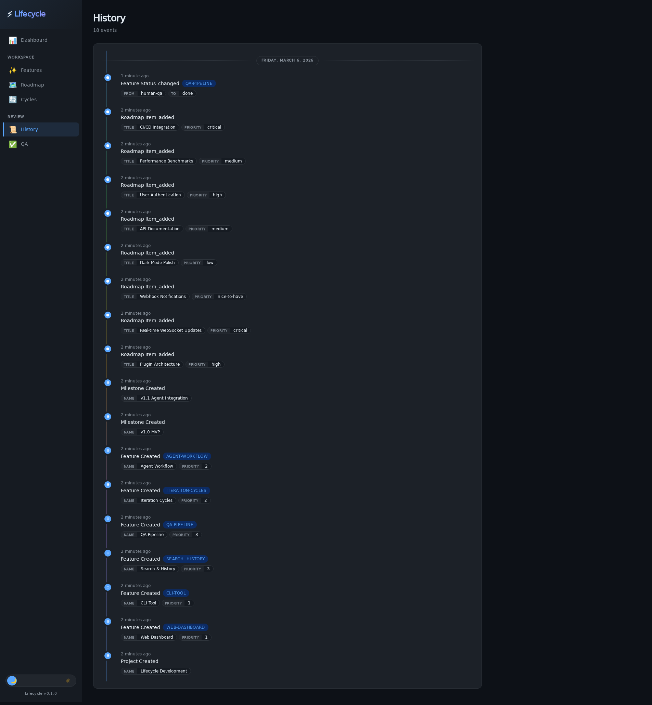
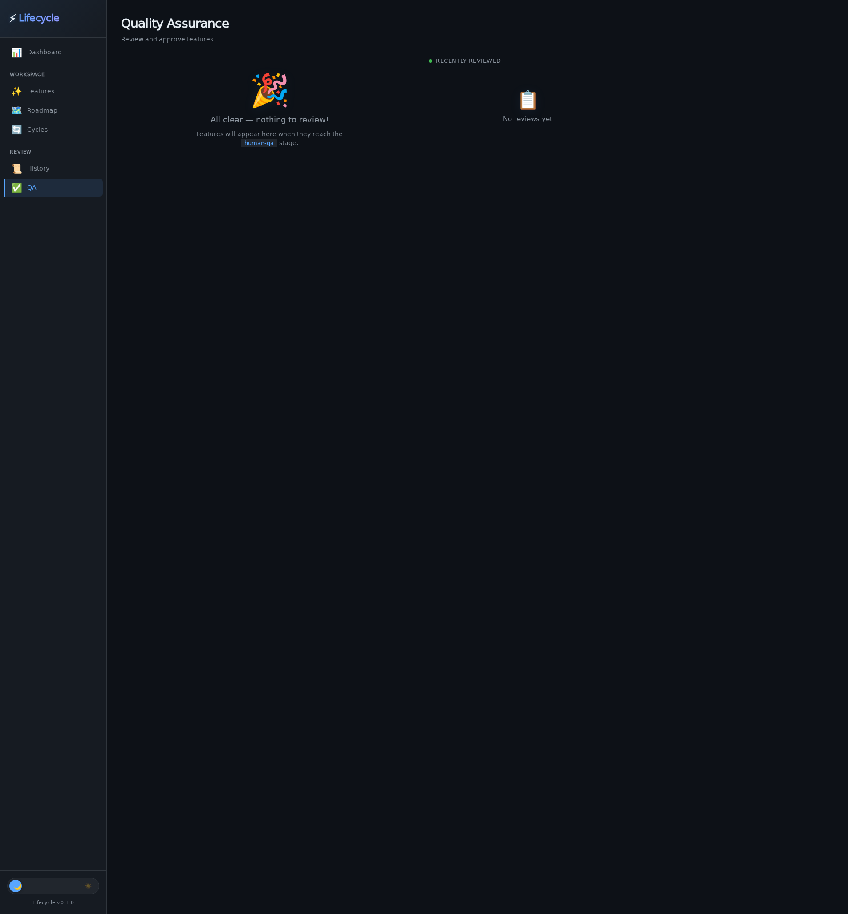

# Tillr — A Guided Tour

*2026-03-06T23:32:43Z by Showboat 0.6.1*
<!-- showboat-id: a59c062f-3b01-466f-8a6c-a61a0141cac5 -->

Welcome to **Tillr** — a human-in-the-loop project management tool for agentic software development. This walkthrough demonstrates the CLI, web viewer, and workflow patterns.

Let's start by initializing a project right here in this repository.

```bash
bin/tillr init 'Tillr Development'
```

```output
✓ Initialized project "Tillr Development" in /workspace
  Database: /workspace/tillr.db
  Config:   /workspace/.tillr.json
```

## Adding Features

Features are the core unit of work. Each has a priority, status, and optional milestone. Let's add several features representing our current development plan.

```bash
bin/tillr feature add "Web Dashboard" --priority 1 --description "Live-updating SPA with dark/light themes, kanban board, and real-time WebSocket updates"
```

```output
✓ Added feature "Web Dashboard" (id: web-dashboard)
```

```bash
bin/tillr feature add "CLI Tool" --priority 1 --description "Complete command-line interface with JSON output for agent integration"
```

```output
✓ Added feature "CLI Tool" (id: cli-tool)
```

```bash
bin/tillr feature add "Agent Workflow" --priority 2 --description "next/done/fail/heartbeat commands for autonomous agent loops"
```

```output
✓ Added feature "Agent Workflow" (id: agent-workflow)
```

```bash
bin/tillr feature add "Iteration Cycles" --priority 2 --description "Structured multi-step workflows: UI refinement, feature implementation, bug triage"
```

```output
✓ Added feature "Iteration Cycles" (id: iteration-cycles)
```

```bash
bin/tillr feature add "QA Pipeline" --priority 3 --description "Human-in-the-loop quality assurance with approve/reject workflow"
```

```output
✓ Added feature "QA Pipeline" (id: qa-pipeline)
```

```bash
bin/tillr feature add "Search & History" --priority 3 --description "Full-text search and audit trail across all project events"
```

```output
✓ Added feature "Search & History" (id: search--history)
```

Now let's see our feature board:

```bash
bin/tillr feature list
```

```output
ID                   STATUS         PRI  NAME
────────────────────────────────────────────────────────────
qa-pipeline          draft          3    QA Pipeline
search--history      draft          3    Search & History
agent-workflow       draft          2    Agent Workflow
iteration-cycles     draft          2    Iteration Cycles
web-dashboard        draft          1    Web Dashboard
cli-tool             draft          1    CLI Tool
```

## Milestones

Group features into release milestones to track progress at a higher level.

```bash
bin/tillr milestone add "v1.0 MVP" --description "Core CLI + web viewer with all essential features"
```

```output
✓ Added milestone "v1.0 MVP" (id: v1.0-mvp)
```

```bash
bin/tillr milestone add "v1.1 Agent Integration" --description "Full agent workflow with iteration cycles"
```

```output
✓ Added milestone "v1.1 Agent Integration" (id: v1.1-agent-integration)
```

```bash
bin/tillr milestone list
```

```output
v1.0-mvp             [░░░░░░░░░░░░░░░░░░░░]   0% (0/0)  [active]
v1.1-agent-integration [░░░░░░░░░░░░░░░░░░░░]   0% (0/0)  [active]
```

## Building the Roadmap

The roadmap captures strategic priorities beyond individual features. Items have priorities (critical → nice-to-have), categories, and effort estimates (t-shirt sizes).

```bash
bin/tillr roadmap add "Real-time WebSocket Updates" --priority critical --category feature --effort l --description "Push live updates to the web viewer when DB changes — no manual refresh needed"
```

```output
✓ Added roadmap item "Real-time WebSocket Updates" (id: real-time-websocket-updates, priority: critical)
```

```bash
bin/tillr roadmap add "Plugin Architecture" --priority high --category architecture --effort xl --description "Extensible plugin system for custom cycle types and integrations"
```

```output
✓ Added roadmap item "Plugin Architecture" (id: plugin-architecture, priority: high)
```

```bash
bin/tillr roadmap add "CI/CD Integration" --priority critical --category feature --effort m --description "GitHub Actions / GitLab CI integration for automated cycle triggers"
```

```output
✓ Added roadmap item "CI/CD Integration" (id: cicd-integration, priority: critical)
```

```bash
bin/tillr roadmap add "Performance Benchmarks" --priority medium --category improvement --effort s --description "Benchmark suite for CLI response times and DB query performance"
```

```output
✓ Added roadmap item "Performance Benchmarks" (id: performance-benchmarks, priority: medium)
```

```bash
bin/tillr roadmap add "User Authentication" --priority high --category feature --effort l --description "Multi-user support with role-based access control"
```

```output
✓ Added roadmap item "User Authentication" (id: user-authentication, priority: high)
```

```bash
bin/tillr roadmap add "API Documentation" --priority medium --category documentation --effort m --description "OpenAPI spec and interactive API docs for all endpoints"
```

```output
✓ Added roadmap item "API Documentation" (id: api-documentation, priority: medium)
```

```bash
bin/tillr roadmap add "Dark Mode Polish" --priority low --category improvement --effort xs --description "Fine-tune dark theme colors, contrast, and animations"
```

```output
✓ Added roadmap item "Dark Mode Polish" (id: dark-mode-polish, priority: low)
```

```bash
bin/tillr roadmap add "Webhook Notifications" --priority nice-to-have --category feature --effort m --description "Notify external services on tillr events via webhooks"
```

```output
✓ Added roadmap item "Webhook Notifications" (id: webhook-notifications, priority: nice-to-have)
```

Check the roadmap health at a glance:

```bash
bin/tillr roadmap stats
```

```output
╔═══════════════════════════════╗
║     📊 Roadmap Statistics     ║
╠═══════════════════════════════╣
║ Total Items:  8               ║
║ Health:       🟢 Good         ║
╠═══════════════════════════════╣
║ By Priority:                  ║
║   🔴 Critical      2           ║
║   🟠 High          2           ║
║   🟡 Medium        2           ║
║   🟢 Low           1           ║
║   🔵 Nice-To-Have  1           ║
╠═══════════════════════════════╣
║ By Category:                  ║
║   architecture    1           ║
║   documentation   1           ║
║   feature         4           ║
║   improvement     2           ║
╠═══════════════════════════════╣
║ By Status:                    ║
║   proposed        8           ║
╚═══════════════════════════════╝
```

## Feature Workflow

Features move through a tillr: **draft → planning → implementing → agent-qa → human-qa → done**. Let's advance some features to simulate active development.

```bash
bin/tillr feature edit web-dashboard --status implementing
```

```output
✓ Updated feature web-dashboard
```

```bash
bin/tillr feature edit cli-tool --status done
```

```output
✓ Updated feature cli-tool
```

```bash
bin/tillr feature edit agent-workflow --status implementing
```

```output
✓ Updated feature agent-workflow
```

```bash
bin/tillr feature edit iteration-cycles --status planning
```

```output
✓ Updated feature iteration-cycles
```

```bash
bin/tillr feature edit qa-pipeline --status human-qa
```

```output
✓ Updated feature qa-pipeline
```

See how the board looks now with features in various stages:

```bash
bin/tillr feature list
```

```output
ID                   STATUS         PRI  NAME
────────────────────────────────────────────────────────────
qa-pipeline          human-qa       3    QA Pipeline
search--history      draft          3    Search & History
agent-workflow       implementing   2    Agent Workflow
iteration-cycles     planning       2    Iteration Cycles
web-dashboard        implementing   1    Web Dashboard
cli-tool             done           1    CLI Tool
```

## Project Status

The `status` command gives you a bird's-eye view of the entire project:

```bash
bin/tillr status
```

```output
Project: Tillr Development

Features: 6 total
  human-qa       1
  implementing   2
  planning       1
  done           1
  draft          1

Milestones: 2
Active Cycles: 0

Recent Activity:
  [2026-03-06 23:33:44] roadmap.item_added
  [2026-03-06 23:33:44] roadmap.item_added
  [2026-03-06 23:33:44] roadmap.item_added
  [2026-03-06 23:33:44] roadmap.item_added
  [2026-03-06 23:33:44] roadmap.item_added
  [2026-03-06 23:33:44] roadmap.item_added
  [2026-03-06 23:33:43] roadmap.item_added
  [2026-03-06 23:33:43] roadmap.item_added
  [2026-03-06 23:33:28] milestone.created
  [2026-03-06 23:33:27] milestone.created
```

## Agent Integration

Agents interact with Tillr via the `next`/`done`/`fail` commands. This is how an AI agent gets its next task:

```bash
bin/tillr next --json
```

```output
{
  "status": "no_work"
}
```

No work items queued yet — agents pull from explicit work items. Let's look at what iteration cycles are available:

```bash
bin/tillr cycle list
```

```output
ui-refinement             UI Refinement
  Steps: design → ux-review → develop → manual-qa → judge

feature-implementation    Feature Implementation
  Steps: research → develop → agent-qa → judge → human-qa

roadmap-planning          Roadmap Planning
  Steps: research → plan → create-roadmap → prioritize → human-review

bug-triage                Bug Triage
  Steps: report → reproduce → root-cause → fix → verify

documentation             Documentation
  Steps: research → draft → review → edit → publish

architecture-review       Architecture Review
  Steps: analyze → propose → discuss → decide → implement

release                   Release
  Steps: freeze → qa → fix → staging → verify → ship

onboarding-dx             Onboarding/DX
  Steps: try → friction-log → improve → verify → document

```

## QA Workflow

Features in `human-qa` status are waiting for human review. Check what's pending:

```bash
bin/tillr qa pending
```

```output
ID                   PRI  NAME
──────────────────────────────────────────────────
qa-pipeline          3    QA Pipeline
```

Approve the QA Pipeline feature:

```bash
bin/tillr qa approve qa-pipeline --notes "Solid implementation, approve for release"
```

```output
✓ Approved feature qa-pipeline → done
```

## History & Search

Every action is logged. Search across all project data:

```bash
bin/tillr search "QA"
```

```output
2026-03-06 23:34:37  feature.status_changed  {"from":"human-qa","to":"done"}
2026-03-06 23:33:11  feature.created  {"name":"QA Pipeline","priority":3}
```

```bash
bin/tillr log
```

```output
2026-03-06 23:34:37 · feature.status_changed qa-pipeline
2026-03-06 23:33:44 · roadmap.item_added
2026-03-06 23:33:44 · roadmap.item_added
2026-03-06 23:33:44 · roadmap.item_added
2026-03-06 23:33:44 · roadmap.item_added
2026-03-06 23:33:44 · roadmap.item_added
2026-03-06 23:33:44 · roadmap.item_added
2026-03-06 23:33:43 · roadmap.item_added
2026-03-06 23:33:43 · roadmap.item_added
2026-03-06 23:33:28 + milestone.created
2026-03-06 23:33:27 + milestone.created
2026-03-06 23:33:11 + feature.created agent-workflow
2026-03-06 23:33:11 + feature.created iteration-cycles
2026-03-06 23:33:11 + feature.created qa-pipeline
2026-03-06 23:33:11 + feature.created search--history
2026-03-06 23:33:10 + feature.created cli-tool
2026-03-06 23:33:02 + feature.created web-dashboard
2026-03-06 23:32:52 + project.created
```

## Web Viewer

Start the web viewer with `tillr serve` to get a live dashboard at http://localhost:3847. Here's what each page looks like:

### Dashboard

The dashboard shows project health at a glance — stat cards, kanban board, milestones, and recent activity.

```bash {image}

```



### Features

Filter, search, and track features across their full tillr. Status pills show where each feature stands.

```bash {image}

```



### Roadmap

The roadmap page is presentation-quality — grouped by priority, with a category breakdown chart, filter pills, effort sizing badges, and expandable item details. Toggle between dark and light themes.

```bash {image}

```



```bash {image}

```



### History

Every action is captured in a searchable timeline with date grouping, event icons, and detail badges.

```bash {image}

```



### QA

Features awaiting human review appear here. Approve or reject with notes — the feature automatically transitions to the next state.

```bash {image}

```



## JSON Output for Agents

Every command supports `--json` for structured output — this is how agents interact with Tillr programmatically:

```bash
bin/tillr feature list --json | python3 -m json.tool | head -20
```

```output
[
    {
        "id": "qa-pipeline",
        "project_id": "tillr-development",
        "name": "QA Pipeline",
        "description": "Human-in-the-loop quality assurance with approve/reject workflow",
        "status": "done",
        "priority": 3,
        "created_at": "2026-03-06 23:33:11",
        "updated_at": "2026-03-06 23:34:37"
    },
    {
        "id": "search--history",
        "project_id": "tillr-development",
        "name": "Search & History",
        "description": "Full-text search and audit trail across all project events",
        "status": "draft",
        "priority": 3,
        "created_at": "2026-03-06 23:33:11",
        "updated_at": "2026-03-06 23:33:11"
```

## Roadmap Export

Export your roadmap as presentation-quality markdown:

```bash
bin/tillr roadmap export --format md | head -35
```

```output
# 🗺️ Project Roadmap — Tillr Development

*Generated: March 6, 2026*

---

## 📊 Summary

| Metric | Count |
|:-------|------:|
| **Total Items** | 8 |
| 🔴 Critical | 2 |
| 🟠 High Priority | 2 |
| 🟡 Medium Priority | 2 |
| 🟢 Low Priority | 1 |
| 🔵 Nice to Have | 1 |
| Status: Proposed | 8 |

---

## 🔴 Critical

### 1. Real-time WebSocket Updates

- **Category:** feature
- **Status:** Proposed
- **Priority:** 🔴 Critical
- **Description:** Push live updates to the web viewer when DB changes — no manual refresh needed

### 2. CI/CD Integration

- **Category:** feature
- **Status:** Proposed
- **Priority:** 🔴 Critical
- **Description:** GitHub Actions / GitLab CI integration for automated cycle triggers
```

## What's Next

The web viewer is running at **http://localhost:3847** — go explore! Try:

- **Click items** on the Roadmap to expand details
- **Toggle dark/light** mode with the theme switch
- **Filter** roadmap items by category or status
- **Print** the roadmap with the 🖨️ button
- Use **↑↓ arrow keys** on the roadmap for keyboard navigation

From the CLI, keep experimenting:

```bash
tillr feature show web-dashboard    # Deep-dive on a feature
tillr roadmap stats --json          # Programmatic roadmap health
tillr doctor                        # Validate your setup
tillr cycle start ui-refinement web-dashboard  # Start an iteration cycle
```

Happy building! 🚀
