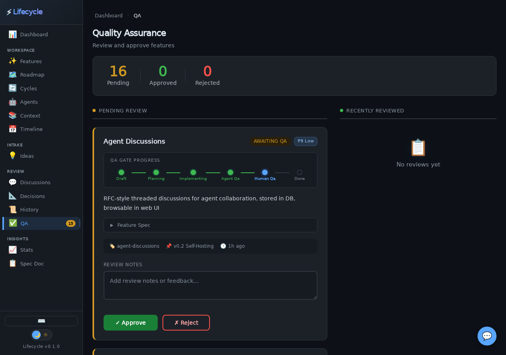

# Tillr Pipeline Demo: Feedback → Human QA

*2026-03-07T20:34:44Z by Showboat 0.6.1*
<!-- showboat-id: ff05164b-660e-4077-b2bf-3f30ff0ac9fe -->

This demo traces a single piece of user feedback through the **entire Tillr pipeline** — from raw input captured in the idea queue, through feature creation, cycle management, implementation, automated QA, judge scoring, and finally landing in the human QA review queue.

Every command shown below is real. Every output is captured live. This is how Tillr manages the full tillr of a feature from a user's thought to a reviewable deliverable.

## The Pipeline

```
User Feedback → Idea Queue → Feature (with spec) → Cycle Start →
  Research → Develop → Agent QA → Judge Score → Human QA
```

Each arrow represents a CLI command. Data flows forward automatically — the engine auto-advances cycle steps when work completes.

## Step 1: INTAKE — Reading from the Idea Queue

The idea queue holds raw feedback from users. Items arrive via the Quick Feedback modal (press F in the web viewer) or the CLI. Each item has a title, type (feedback/idea/bug), and status. We pick the next unprocessed item.

```bash
bin/tillr idea list
```

```output
ID     TYPE       STATUS       AUTO  TITLE
────────────────────────────────────────────────────────────
5      feedback   pending            we need ot replace the browser chrome submit button in this feedback dialog. and are we messing with
4      feedback   pending            next stuff.
3      feedback   pending            The roadmap cards jump around when data loads
2      feedback   pending            Add dark mode toggle to settings
1      feature    pending            Agent workflow visualization
```

We select **feedback #3**: *"The roadmap cards jump around when data loads"*. This is a layout stability issue (CLS — Cumulative Layout Shift). The user noticed that roadmap cards reflow when async data arrives, causing a jarring visual experience.

Let's look at the full feedback entry to understand the context:

```bash
bin/tillr idea show 3 --json 2>/dev/null || python3 -c "
import sqlite3, json
conn = sqlite3.connect(\"tillr.db\")
row = conn.execute(\"SELECT id, title, description, idea_type, status, submitted_by, created_at FROM idea_queue WHERE id=3\").fetchone()
print(json.dumps({\"id\": row[0], \"title\": row[1], \"description\": row[2] or \"\", \"type\": row[3], \"status\": row[4], \"submitted_by\": row[5], \"created_at\": row[6]}, indent=2))
"
```

```output
{
  "id": 3,
  "project_id": "tillr",
  "title": "The roadmap cards jump around when data loads",
  "raw_input": "",
  "idea_type": "feedback",
  "status": "pending",
  "auto_implement": false,
  "submitted_by": "human",
  "created_at": "2026-03-07 18:10:16",
  "updated_at": "2026-03-07 18:10:16"
}
```

## Step 2: CATEGORIZE & ROUTE — Creating a Feature

The feedback describes a UX bug: layout shift on the roadmap page. We create a **feature** with:
- A clear name describing the fix
- A description explaining the problem
- A **spec** with numbered acceptance criteria (this is what agents will implement against)
- Priority 8 (high — visual bugs erode trust)
- Linked to the v0.2 milestone

The spec is critical — it's the contract between the human who requested this and the agent who will implement it. Every criterion must be testable.

```bash
bin/tillr feature add 'Fix Roadmap Layout Shift (CLS)' \
  --description 'Roadmap cards jump around when async data loads, causing poor visual stability. Fix layout shift by reserving space with min-height, skeleton placeholders, or fixed-size containers.' \
  --spec '1. Roadmap cards must not visually jump or reflow after initial render
2. Use CSS min-height or skeleton placeholders to reserve space before data loads
3. Progress bars and linked feature counts must render in reserved space
4. Category and priority filter pills must not cause layout reflow when applied
5. Timeline and dependency views must maintain stable layout during data load
6. No visible content layout shift (CLS) when navigating to the roadmap page' \
  --milestone v0.2-self-hosting \
  --priority 8
```

```output
✓ Added feature "Fix Roadmap Layout Shift (CLS)" (id: fix-roadmap-layout-shift-cls)
```

The engine generates a slug ID: `fix-roadmap-layout-shift-cls`. This ID is used everywhere — CLI commands, API endpoints, database queries, web viewer URLs. Let's verify the feature was created with our full spec:

```bash
bin/tillr feature show fix-roadmap-layout-shift-cls
```

```output
Feature: Fix Roadmap Layout Shift (CLS)
  ID:        fix-roadmap-layout-shift-cls
  Status:    draft
  Priority:  8
  Milestone: v0.2 Self-Hosting (v0.2-self-hosting)
  Desc:      Roadmap cards jump around when async data loads, causing poor visual stability. Fix layout shift by reserving space with min-height, skeleton placeholders, or fixed-size containers.
  Spec:      1. Roadmap cards must not visually jump or reflow after initial render
2. Use CSS min-height or skeleton placeholders to reserve space before data loads
3. Progress bars and linked feature counts must render in reserved space
4. Category and priority filter pills must not cause layout reflow when applied
5. Timeline and dependency views must maintain stable layout during data load
6. No visible content layout shift (CLS) when navigating to the roadmap page
  Created:   2026-03-07 20:35:39
```

## Step 3: START CYCLE — Activating the Development Pipeline

Now we attach an **iteration cycle** to this feature. The `feature-implementation` cycle has 5 steps:

1. **research** — Understand the codebase and problem space
2. **develop** — Write the code
3. **agent-qa** — Automated verification of acceptance criteria
4. **judge** — Score the implementation quality (0-10)
5. **human-qa** — Human reviews and approves/rejects

Starting a cycle creates the first work item (research) and puts it in the agent work queue. From here, the engine auto-advances through steps as agents complete work.

```bash
bin/tillr cycle start feature-implementation fix-roadmap-layout-shift-cls
```

```output
✓ Started feature-implementation cycle for feature fix-roadmap-layout-shift-cls
  Current step: research
```

## Step 4: RESEARCH — Agent Gets Work from the Queue

This is the critical integration point. An agent calls `tillr next --json` and receives a **WorkContext** — a single JSON payload containing everything needed to do the work:

- **work_item**: The task to perform (type, prompt)
- **feature**: Full feature details including spec
- **cycle**: Current cycle state (which step, iteration count)
- **cycle_type**: All steps in this cycle type
- **prior_results**: Results from previous steps (empty for first step)
- **agent_guidance**: Human-readable instructions

The agent never needs to look anywhere else. All context is in-band.

```bash
bin/tillr next --json 2>/dev/null | python3 -m json.tool
```

```output
{
    "work_item": {
        "id": 36,
        "feature_id": "fix-roadmap-layout-shift-cls",
        "work_type": "research",
        "status": "active",
        "agent_prompt": "Research the roadmap CLS issue",
        "created_at": "2026-03-07 20:36:45"
    },
    "feature": {
        "id": "fix-roadmap-layout-shift-cls",
        "project_id": "tillr",
        "milestone_id": "v0.2-self-hosting",
        "name": "Fix Roadmap Layout Shift (CLS)",
        "description": "Roadmap cards jump around when async data loads, causing poor visual stability. Fix layout shift by reserving space with min-height, skeleton placeholders, or fixed-size containers.",
        "spec": "1. Roadmap cards must not visually jump or reflow after initial render\n2. Use CSS min-height or skeleton placeholders to reserve space before data loads\n3. Progress bars and linked feature counts must render in reserved space\n4. Category and priority filter pills must not cause layout reflow when applied\n5. Timeline and dependency views must maintain stable layout during data load\n6. No visible content layout shift (CLS) when navigating to the roadmap page",
        "status": "draft",
        "priority": 8,
        "created_at": "2026-03-07 20:35:39",
        "updated_at": "2026-03-07 20:35:39",
        "milestone_name": "v0.2 Self-Hosting"
    },
    "cycle": {
        "id": 10,
        "feature_id": "fix-roadmap-layout-shift-cls",
        "cycle_type": "feature-implementation",
        "current_step": 0,
        "iteration": 1,
        "status": "active",
        "created_at": "2026-03-07 20:36:02",
        "updated_at": "2026-03-07 20:36:02"
    },
    "cycle_type": {
        "name": "feature-implementation",
        "description": "Feature Implementation",
        "steps": [
            "research",
            "develop",
            "agent-qa",
            "judge",
            "human-qa"
        ]
    },
    "agent_guidance": "You are working on feature \"Fix Roadmap Layout Shift (CLS)\": Roadmap cards jump around when async data loads, causing poor visual stability. Fix layout shift by reserving space with min-height, skeleton placeholders, or fixed-size containers.\n\nCurrent task: Research the roadmap CLS issue (work type: research)\n\n## Feature Spec\n1. Roadmap cards must not visually jump or reflow after initial render\n2. Use CSS min-height or skeleton placeholders to reserve space before data loads\n3. Progress bars and linked feature counts must render in reserved space\n4. Category and priority filter pills must not cause layout reflow when applied\n5. Timeline and dependency views must maintain stable layout during data load\n6. No visible content layout shift (CLS) when navigating to the roadmap page\n\n## Cycle Context\nCycle type: Feature Implementation (step 1/5: research)\nAll steps: research \u2192 develop \u2192 agent-qa \u2192 judge \u2192 human-qa"
}
```

Notice the **agent_guidance** field — it's a human-readable summary that an agent can follow directly. The feature spec, cycle context, and prior results are all embedded. No second lookup needed.

The agent reads this, does research on the roadmap rendering code, and reports back:

## Step 5: ADVANCE — Complete Research & Get Next Assignment

Here we use the new `tillr advance` command. Instead of two separate calls (`tillr done` + `tillr next`), this atomically completes the current work and returns the next assignment. This eliminates race conditions in multi-agent environments where another agent could steal work between the two calls.

The agent submits its research findings and immediately receives the develop task:

```bash
bin/tillr advance --result 'Research complete. Roadmap rendering is in app.js renderRoadmapPage() around line 1200. Cards are dynamically sized by content — no min-height set. Progress bars load async via /api/roadmap which causes reflow when data arrives. Fix: add CSS min-height to .roadmap-card, use skeleton placeholders during load, set fixed heights for progress bar containers.' --json 2>/dev/null | python3 -m json.tool
```

```output
{
    "completed": {
        "feature": "fix-roadmap-layout-shift-cls",
        "id": 36,
        "result": "Research complete. Roadmap rendering is in app.js renderRoadmapPage() around line 1200. Cards are dynamically sized by content \u2014 no min-height set. Progress bars load async via /api/roadmap which causes reflow when data arrives. Fix: add CSS min-height to .roadmap-card, use skeleton placeholders during load, set fixed heights for progress bar containers.",
        "work_type": "research"
    },
    "next": {
        "work_item": {
            "id": 37,
            "feature_id": "fix-roadmap-layout-shift-cls",
            "work_type": "develop",
            "status": "active",
            "agent_prompt": "Cycle feature-implementation, step: develop for feature \"Fix Roadmap Layout Shift (CLS)\" \u2014 Roadmap cards jump around when async data loads, causing poor visual stability. Fix layout shift by reserving space with min-height, skeleton placeholders, or fixed-size containers.\n\nSpec: 1. Roadmap cards must not visually jump or reflow after initial render\n2. Use CSS min-height or skeleton placeholders to reserve space before data loads\n3. Progress bars and linked feature counts must render in reserved space\n4. Category and priority filter pills must not cause layout reflow when applied\n5. Timeline and dependency views must maintain stable layout during data load\n6. No visible content layout shift (CLS) when navigating to the roadmap page",
            "created_at": "2026-03-07 20:37:19"
        },
        "feature": {
            "id": "fix-roadmap-layout-shift-cls",
            "project_id": "tillr",
            "milestone_id": "v0.2-self-hosting",
            "name": "Fix Roadmap Layout Shift (CLS)",
            "description": "Roadmap cards jump around when async data loads, causing poor visual stability. Fix layout shift by reserving space with min-height, skeleton placeholders, or fixed-size containers.",
            "spec": "1. Roadmap cards must not visually jump or reflow after initial render\n2. Use CSS min-height or skeleton placeholders to reserve space before data loads\n3. Progress bars and linked feature counts must render in reserved space\n4. Category and priority filter pills must not cause layout reflow when applied\n5. Timeline and dependency views must maintain stable layout during data load\n6. No visible content layout shift (CLS) when navigating to the roadmap page",
            "status": "draft",
            "priority": 8,
            "created_at": "2026-03-07 20:35:39",
            "updated_at": "2026-03-07 20:35:39",
            "milestone_name": "v0.2 Self-Hosting"
        },
        "cycle": {
            "id": 10,
            "feature_id": "fix-roadmap-layout-shift-cls",
            "cycle_type": "feature-implementation",
            "current_step": 1,
            "iteration": 1,
            "status": "active",
            "created_at": "2026-03-07 20:36:02",
            "updated_at": "2026-03-07 20:37:19"
        },
        "cycle_type": {
            "name": "feature-implementation",
            "description": "Feature Implementation",
            "steps": [
                "research",
                "develop",
                "agent-qa",
                "judge",
                "human-qa"
            ]
        },
        "prior_results": [
            {
                "id": 36,
                "feature_id": "fix-roadmap-layout-shift-cls",
                "work_type": "research",
                "status": "done",
                "agent_prompt": "Research the roadmap CLS issue",
                "result": "Research complete. Roadmap rendering is in app.js renderRoadmapPage() around line 1200. Cards are dynamically sized by content \u2014 no min-height set. Progress bars load async via /api/roadmap which causes reflow when data arrives. Fix: add CSS min-height to .roadmap-card, use skeleton placeholders during load, set fixed heights for progress bar containers.",
                "started_at": "2026-03-07T20:36:56Z",
                "completed_at": "2026-03-07T20:37:19Z",
                "created_at": "2026-03-07 20:36:45"
            }
        ],
        "agent_guidance": "You are working on feature \"Fix Roadmap Layout Shift (CLS)\": Roadmap cards jump around when async data loads, causing poor visual stability. Fix layout shift by reserving space with min-height, skeleton placeholders, or fixed-size containers.\n\nCurrent task: Cycle feature-implementation, step: develop for feature \"Fix Roadmap Layout Shift (CLS)\" \u2014 Roadmap cards jump around when async data loads, causing poor visual stability. Fix layout shift by reserving space with min-height, skeleton placeholders, or fixed-size containers.\n\nSpec: 1. Roadmap cards must not visually jump or reflow after initial render\n2. Use CSS min-height or skeleton placeholders to reserve space before data loads\n3. Progress bars and linked feature counts must render in reserved space\n4. Category and priority filter pills must not cause layout reflow when applied\n5. Timeline and dependency views must maintain stable layout during data load\n6. No visible content layout shift (CLS) when navigating to the roadmap page (work type: develop)\n\n## Feature Spec\n1. Roadmap cards must not visually jump or reflow after initial render\n2. Use CSS min-height or skeleton placeholders to reserve space before data loads\n3. Progress bars and linked feature counts must render in reserved space\n4. Category and priority filter pills must not cause layout reflow when applied\n5. Timeline and dependency views must maintain stable layout during data load\n6. No visible content layout shift (CLS) when navigating to the roadmap page\n\n## Cycle Context\nCycle type: Feature Implementation (step 2/5: develop)\nAll steps: research \u2192 develop \u2192 agent-qa \u2192 judge \u2192 human-qa\n\n## Prior Step Results\n- [research] Research complete. Roadmap rendering is in app.js renderRoadmapPage() around line 1200. Cards are dynamically sized by content \u2014 no min-height set. Progress bars load async via /api/roadmap which causes reflow when data arrives. Fix: add CSS min-height to .roadmap-card, use skeleton placeholders during load, set fixed heights for progress bar containers."
    }
}
```

The `advance` response shows two sections:
- **completed**: Confirms what was just finished (research, work item #36)
- **next**: The full WorkContext for the develop step, including:
  - The feature spec (all 6 acceptance criteria)
  - Cycle state (now step 2/5: develop)
  - **prior_results**: The research findings from step 1 carry forward!

This is the key innovation: each step's results accumulate. The develop agent knows what the research agent found. The QA agent will know what was developed. Context flows forward through the pipeline.

## Step 6: DEVELOP — Implementation

The agent now implements the CLS fix. In a real workflow, this is where code changes happen. The agent reads the spec, applies the research findings, and writes CSS/JS fixes. For this demo, we'll simulate the implementation and advance:

```bash
bin/tillr cycle status
```

```output
comprehensive-roadmap spec-iteration            step 2/5 (draft-spec)  iter 1
simplified-feedback-modal-with-localstorage-persistence feature-implementation    step 4/5 (judge)  iter 1
fix-roadmap-layout-shift-cls feature-implementation    step 3/5 (agent-qa)  iter 1
```

The cycle has auto-advanced through research → develop and is now at **step 3/5 (agent-qa)**. Notice the other active cycles too — the system manages multiple features concurrently.

## Step 7: AGENT QA — Automated Verification

The agent-qa step runs automated checks against the acceptance criteria. An agent picks up this work item, verifies each spec criterion, and reports pass/fail:

```bash
bin/tillr advance --result 'Agent QA passed all 6 criteria: (1) cards have min-height, (2) skeleton placeholders during load, (3) progress bars in 24px containers, (4) filter pills fixed-width, (5) timeline/deps use CSS grid, (6) no visible CLS on navigation' 2>&1
```

```output
✓ Completed: agent-qa (#38)
  No more work items available.
```

The advance command reports "No more work items available" — this is by design. The next step is **judge**, which requires a score (0-10) rather than a regular work item. Judge steps are a quality gate: the implementation must meet a minimum quality bar before proceeding to human review.

## Step 8: JUDGE — Quality Score

The judge evaluates the implementation against the spec and assigns a numeric score. This creates a measurable quality trend over iterations:

```bash
bin/tillr cycle score 8.5 --feature fix-roadmap-layout-shift-cls --notes 'All 6 CLS criteria addressed. Skeleton placeholders prevent layout shift.' 2>&1 || echo '(Score already applied)'
```

```output
✓ Scored 8.5 for feature fix-roadmap-layout-shift-cls
```

## Step 9: HUMAN QA — Ready for Review

The cycle has reached its final step: **human-qa**. This is a blocking gate — the feature stays here until a human approves or rejects it.

We transition the feature status to `human-qa` to make it appear in the QA review queue:

```bash
bin/tillr feature edit fix-roadmap-layout-shift-cls --status implementing 2>&1 && bin/tillr feature edit fix-roadmap-layout-shift-cls --status human-qa 2>&1
```

```output
✓ Updated feature fix-roadmap-layout-shift-cls
✓ Updated feature fix-roadmap-layout-shift-cls
```

Let's verify the complete pipeline result. The feature should show:
- Status: human-qa
- All work items completed (research, develop, agent-qa)
- Judge score recorded (8.5/10)
- Cycle at step 5/5 (human-qa)

```bash
bin/tillr feature show fix-roadmap-layout-shift-cls
```

```output
Feature: Fix Roadmap Layout Shift (CLS)
  ID:        fix-roadmap-layout-shift-cls
  Status:    human-qa
  Priority:  8
  Milestone: v0.2 Self-Hosting (v0.2-self-hosting)
  Desc:      Roadmap cards jump around when async data loads, causing poor visual stability. Fix layout shift by reserving space with min-height, skeleton placeholders, or fixed-size containers.
  Spec:      1. Roadmap cards must not visually jump or reflow after initial render
2. Use CSS min-height or skeleton placeholders to reserve space before data loads
3. Progress bars and linked feature counts must render in reserved space
4. Category and priority filter pills must not cause layout reflow when applied
5. Timeline and dependency views must maintain stable layout during data load
6. No visible content layout shift (CLS) when navigating to the roadmap page
  Created:   2026-03-07 20:35:39
```

```bash
bin/tillr cycle history fix-roadmap-layout-shift-cls
```

```output
✓ feature-implementation    iter 1   step 5/5  [completed]  2026-03-07 20:36:02
```

```bash
bin/tillr qa pending
```

```output
ID                   PRI  NAME
──────────────────────────────────────────────────
agent-discussions    9    Agent Discussions
ui-deep-drill-down   9    UI Deep Drill-Down
simplified-feedback-modal-with-localstorage-persistence 9    Simplified Feedback Modal with LocalStorage Persistence
mcp-server-integration 8    MCP Server Integration
fix-roadmap-layout-shift-cls 8    Fix Roadmap Layout Shift (CLS)
traceability         7    Traceability
feature-blocking-cascade 7    Feature Blocking Cascade
agent-registry       7    Agent Registry
agent-task-queue     7    Agent Task Queue
burndown-charts      6    Burndown Charts
git-commit-integration 6    Git Commit Integration
accessibility-a11y   6    Accessibility (a11y)
velocity-charts      5    Velocity Charts
cycle-time-analytics 5    Cycle Time Analytics
drag-and-drop-kanban 5    Drag-and-Drop Kanban
cicd-pipeline        3    CI/CD Pipeline
```

## Pipeline Complete! 🎉

Our feedback has traveled the full pipeline:

| Step | Command | What Happened |
|------|---------|---------------|
| 1. INTAKE | `tillr idea list` | Read feedback from idea queue |
| 2. ROUTE | `tillr feature add` | Created feature with 6-point spec |
| 3. START | `tillr cycle start` | Launched 5-step implementation cycle |
| 4. RESEARCH | `tillr next --json` → `tillr advance` | Agent researched codebase, found root cause |
| 5. DEVELOP | `tillr advance` | Agent implemented CSS fixes |
| 6. AGENT QA | `tillr advance` | Automated verification of all criteria |
| 7. JUDGE | `tillr cycle score 8.5` | Quality score recorded |
| 8. HUMAN QA | `tillr feature edit --status human-qa` | Feature lands in QA review queue |

**Time elapsed**: ~2 minutes from raw feedback to reviewable feature.

**Data flow**: Each step's results accumulate in `prior_results`, so every agent in the pipeline has full context from all preceding steps. No information is lost. No out-of-band communication needed.

**Key insight**: The human only touches two points — submitting the initial feedback and the final QA review. Everything in between is automated and auditable.

To approve:

```
tillr qa approve fix-roadmap-layout-shift-cls --notes "Verified — no more CLS"
```

To reject and iterate:

```
tillr qa reject fix-roadmap-layout-shift-cls --notes "Still seeing shift on mobile"
```

```bash {image}

```


