# Lifecycle Product Walkthrough

A visual tour of every page in the Lifecycle web viewer.

## Dashboard

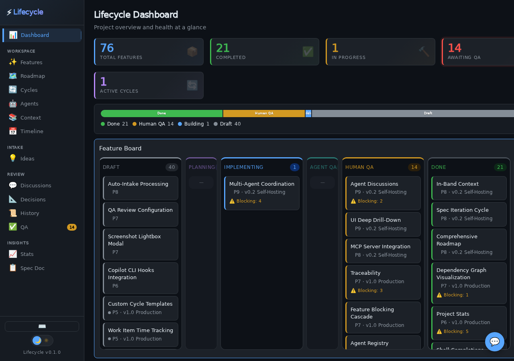

The Dashboard provides a project health overview at a glance — feature counts by status, a kanban-style feature board, milestone progress bars, and recent activity. It also surfaces roadmap highlights, priority distribution, active cycles, project stats, and recent VCS commits. This is your landing page for quickly assessing where things stand.

## Features

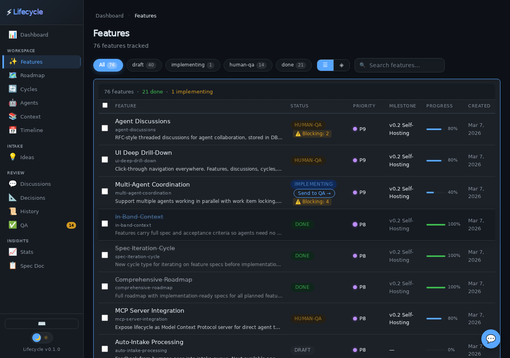

The Features page lists all tracked features with status badges, priority indicators, and milestone assignments. You can filter by status, search by name, and click any feature to expand its full history and spec. Use this page when you need to find, triage, or update individual features.

## Roadmap

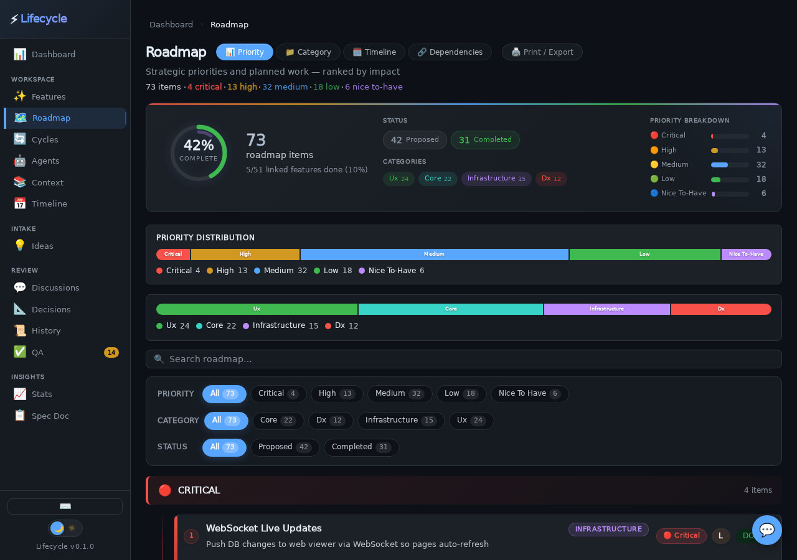

The Roadmap page displays a prioritized, categorized view of strategic work items with effort estimates and status indicators. Items are ranked by priority and show linked features. Use this page for stakeholder reviews or when planning what to build next.

## Cycles

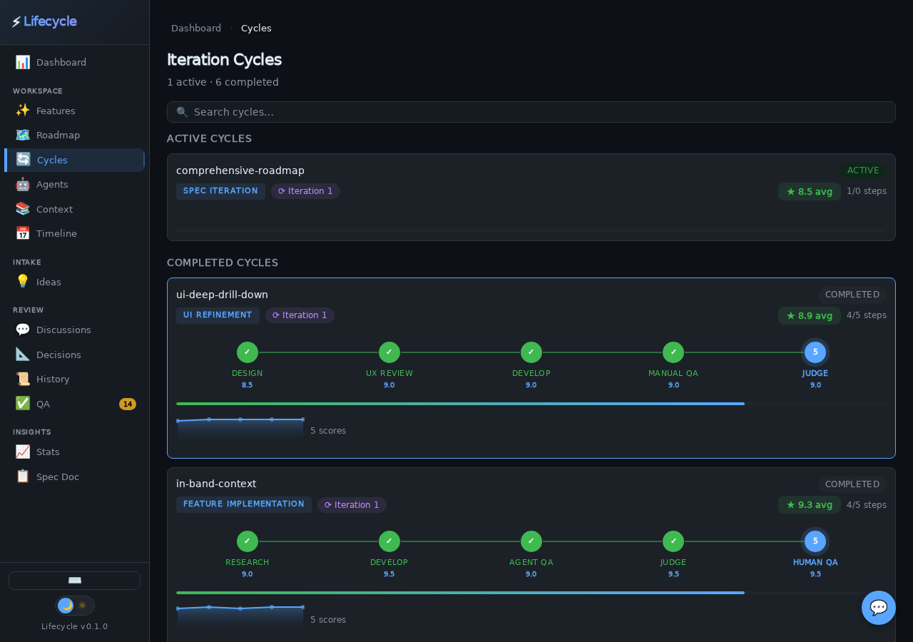

The Cycles page shows active iteration cycles — the structured workflows that drive features through steps like research, develop, QA, and judge. You can see the current step, iteration count, and score history. Use this page to monitor in-flight work and understand where each feature is in its lifecycle.

## QA

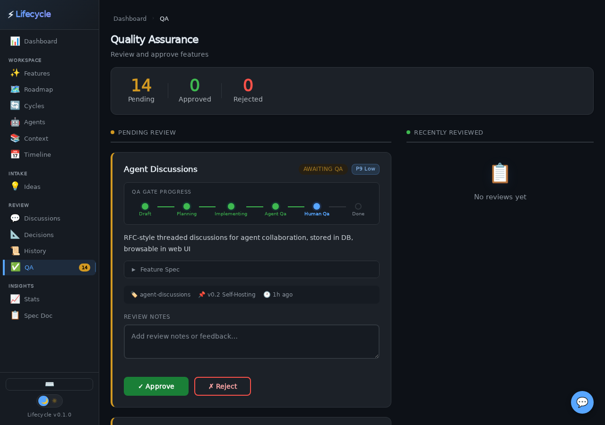

The QA page lists features awaiting human review. Each item shows its spec and cycle history so reviewers have full context. Approve or reject features with notes directly from this page. Use this when you're the human in the loop and need to sign off on completed work.

## Stats

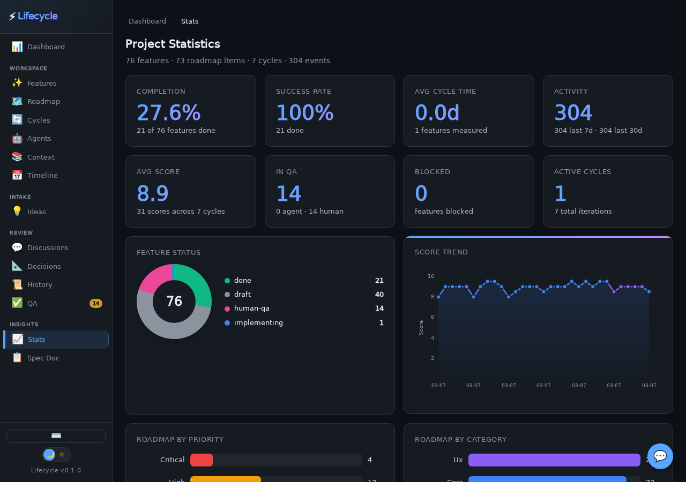

The Stats page presents project analytics — feature status distribution, cycle time histograms, success rates, and spec coverage metrics. Charts and counters give you a quantitative view of project health. Use this page to identify bottlenecks and track progress over time.

## History

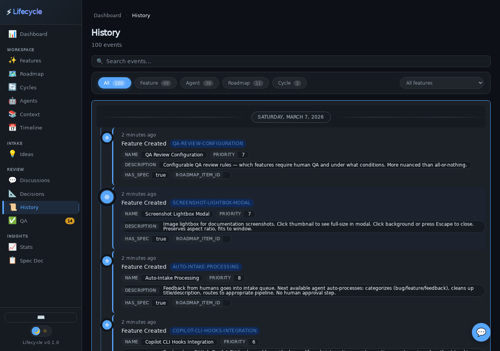

The History page provides a searchable, filterable event timeline of everything that has happened in the project. Events include feature creation, status changes, cycle completions, and QA decisions. Use this page to audit activity or trace when and why a change occurred.

## Agents

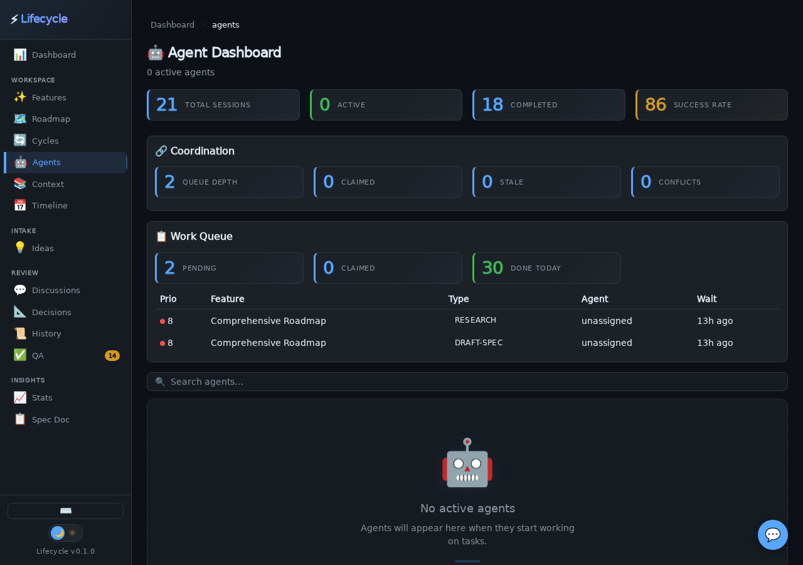

The Agents page is a dashboard for AI agents working on the project. It shows registered agents, their current assignments, heartbeat status, and task history. Use this page to monitor agent activity and detect stale or stuck workers.

## Ideas

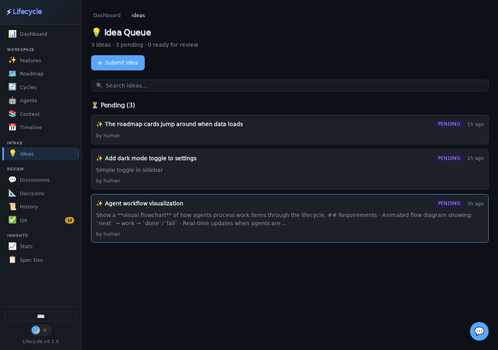

The Ideas page is an intake queue for feature suggestions and raw ideas before they become formal features. Ideas can be promoted to features when they're ready. Use this page to capture inspiration without cluttering the main feature board.

## Discussions

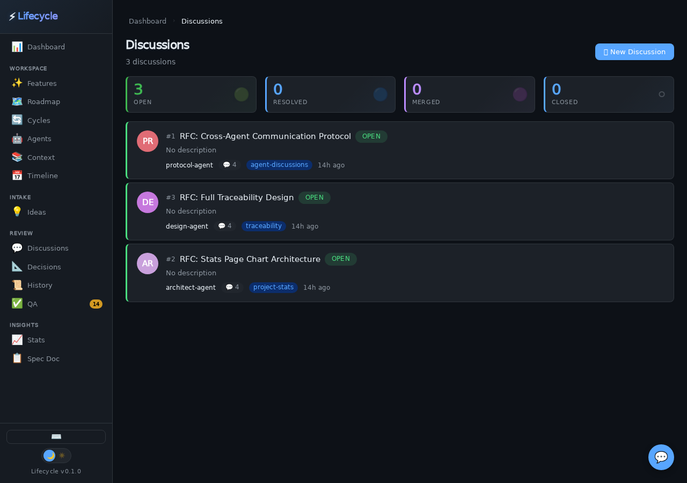

The Discussions page hosts threaded conversations for design decisions, RFCs, and open questions. Participants can post comments, proposals, and resolutions. Use this page when a feature needs collaborative input before implementation begins.

## Timeline

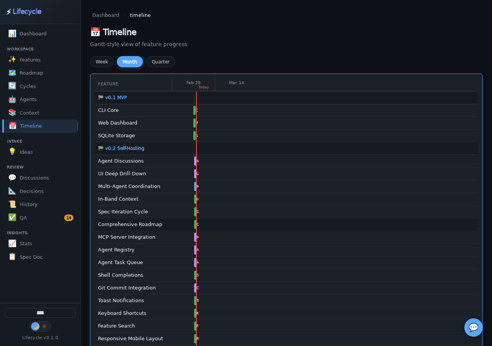

The Timeline page visualizes features and milestones on a temporal axis, showing when work started, progressed, and completed. It provides a Gantt-style overview of parallel workstreams. Use this page to understand scheduling, overlaps, and overall project cadence.

## Decisions

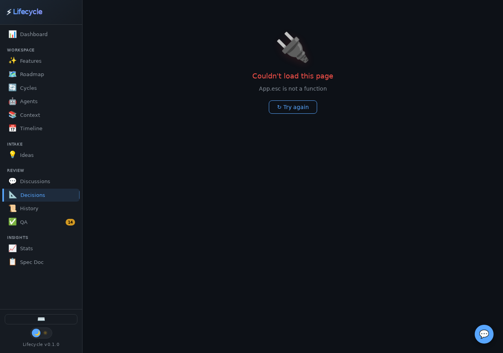

The Decisions page (ADR log) records architectural and design decisions with their context, rationale, and status. Each decision is numbered and tracks who proposed it and when. Use this page to maintain institutional knowledge and understand why the project is built the way it is.
